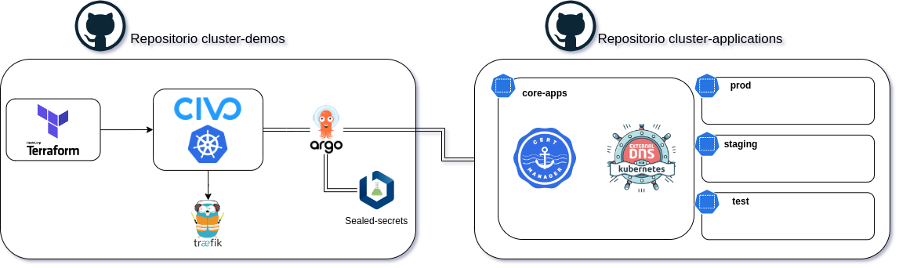

# Descripción proyecto

Cluster proporcionado por **Civo Cloud** para el Cloud Native Rioja.

## Diagrama de arquitectura

## Objetivo

El cluster proporcionado por Civo Cloud se utilizará para el desarrollo de aplicaciones y servicios de la comunidad Cloud Native Rioja. Se utilizará para realizar pruebas de concepto, despliegue de aplicaciones y servicios, y para la realización de talleres y eventos.

## Funcionamiento

El cluster actualmente está compuesto por 3 nodos de 4Gb Ram y 2vCPU cada uno. Simplemente se han creado 2 workflow en Github para el despliegue de la infraestructura y la instalación de aplicaciones adicionales.

## Despliegue

Para el despliegue de la infraestructura se ha utilizado Terraform, el cual se encarga de crear los nodos y las aplicaciones adicionales. Para ello se ha creado un workflow en Github que se ejecuta al realizar un push en la rama master.

## Configuración

Para la configuración del cluster se ha creado un fichero llamado `config.yaml`, en el cual se especifican los párametros para cambiar dinamicamente variables como la cantidad y tipo de nodos, el software de configuración del cluster, nombre del cluster, aplicaciones por defecto a instalar...
